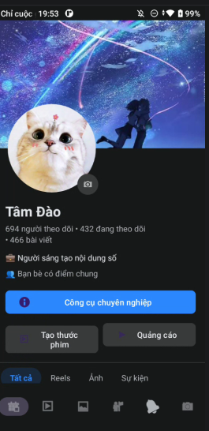

# Facebook Profile UI Clone - Android Homework

Dự án bài tập về nhà mô phỏng giao diện trang cá nhân Facebook (Dark Mode) y hệt mẫu, sử dụng các thành phần UI cơ bản và nâng cao trong Android.

## Hình ảnh Demo

## Các thành phần chính
- **Giao diện tổng thể:** Sử dụng `FrameLayout` làm gốc để quản lý lớp nội dung và thanh điều hướng dưới cùng.
- **Cuộn nội dung:** `NestedScrollView` giúp cuộn mượt mà toàn bộ các thành phần trên trang cá nhân.
- **Header:**
  - Ảnh bìa (Cover) và Ảnh đại diện (Avatar) được xếp chồng bằng `ConstraintLayout`.
  - Ảnh đại diện sử dụng `ShapeableImageView` để bo tròn hoàn hảo.
- **Tabs điều hướng:** `HorizontalScrollView` chứa các mục Tất cả, Reels, Ảnh, Sự kiện.
- **Thông tin & Giáo dục:** Hiển thị chi tiết địa chỉ, ngày sinh và trường học (HaUI).
- **Bạn bè & Tin nổi bật:** Danh sách bạn bè và các Story nổi bật sử dụng `MaterialCardView`.
- **Bài viết:** Mô phỏng ô đăng trạng thái và một bài viết mẫu với hình ảnh.

## Công nghệ & Thư viện
- **Layouts:** `FrameLayout`, `ConstraintLayout`, `LinearLayout`, `RelativeLayout`.
- **Material Design:** `MaterialButton`, `MaterialCardView`, `BottomNavigationView`.
- **Resources:** Sử dụng bộ màu chuẩn Dark Mode của Facebook (`#18191a`, `#242526`, `#2e89ff`).

## Cách chạy dự án
1. Mở project trong Android Studio.
2. Đảm bảo các file ảnh trong thư mục `res/drawable` đầy đủ (`avatar.png`, `background.png`, `avatar_haui.png`, `avatar_friend_1.png`,...).
3. Build và chạy trên thiết bị (ưu tiên màn hình 1080x1920 hoặc tương đương).

---
**Người thực hiện:** Đào Đức Tâm
**Lớp:** ADR58 - DevPro
**Bài tập:** Day 3 - Giao diện Android cơ bản.