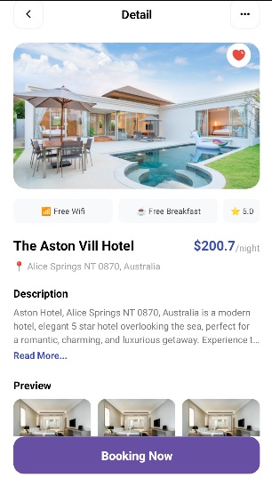

# ADR58_DaoDucTam_Day4 - Hotel Detail Screen

## Mô tả dự án
Đây là bài tập về nhà buổi 4 của khóa học Android (ADR58). Dự án tập trung vào việc thiết kế giao diện chi tiết khách sạn (Hotel Detail) giống hệt mẫu thiết kế, sử dụng các cú pháp đơn giản, dễ hiểu cho người mới bắt đầu.

## Tính năng chính
*   **Giao diện Responsive:** Sử dụng `ConstraintLayout` và `NestedScrollView` để đảm bảo hiển thị tốt trên nhiều kích thước màn hình khác nhau.
*   **Mở rộng nội dung (Expandable Text):** Phần mô tả (Description) có tính năng "Read More..." để mở rộng và "Collapse" để thu gọn nội dung, giúp giao diện gọn gàng hơn.
*   **Thành phần giao diện:**
    *   Sử dụng `CardView` để bo tròn góc ảnh và tạo chiều sâu.
    *   Tùy chỉnh các nút bấm (Back, More, Booking) bằng `Drawable XML`.
    *   Hiển thị các tiện ích (Wifi, Breakfast, Rating) dưới dạng chip.
    *   Nút "Booking Now" được cố định ở dưới cùng màn hình.

## Giao diện ứng dụng
 

## Công nghệ sử dụng
*   Ngôn ngữ: Java
*   Giao diện: XML (ConstraintLayout, CardView, NestedScrollView)
*   Thư viện: AndroidX AppCompat, Material Components

---
**Học viên:** Đào Đức Tâm
**Khóa học:** ADR58 - DevPro
