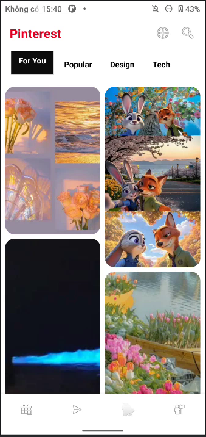

# Pinterest UI Demo - Android RecyclerView

Dự án demo giao diện Pinterest sử dụng `RecyclerView` với `StaggeredGridLayoutManager` trong Android. Đồ án tập trung vào việc xử lý bố cục lưới không đồng nhất (asymmetrical grid) một cách tối giản, không sử dụng thư viện bên thứ ba.

## 📸 Demo

## 🚀 Tính năng nổi bật

- **Pinterest Layout:** Sử dụng `StaggeredGridLayoutManager` để tạo lưới ảnh so le, tự động lấp đầy khoảng trống.
- **Dynamic Height:** Giả lập chiều cao ảnh ngẫu nhiên để tối ưu hóa việc hiển thị bố cục so le.
- **Material Design:** Tận dụng `MaterialCardView` để bo góc và tạo hiệu ứng đổ bóng hiện đại.
- **Zero Third-party Library:** Không dùng Glide, Picasso hay các thư viện ngoài. Sử dụng ảnh thật trực tiếp từ bộ nhớ `drawable`.
- **Edge-to-Edge:** Hỗ trợ hiển thị tràn viền trên các thiết bị Android hiện đại.

## 🛠 Công nghệ sử dụng

- **Ngôn ngữ:** Java
- **UI Framework:** Material Components (Google)
- **Layout:** ConstraintLayout, RecyclerView, MaterialCardView
- **SDK:** Target SDK 36, Min SDK 24

## 📂 Cấu trúc dự án chính

- `MainActivity.java`: Khởi tạo danh sách dữ liệu và thiết lập `RecyclerView` với 2 cột so le.
- `Pin.java`: Model chứa thông tin tài nguyên ảnh (`imageResId`) và chiều cao mong muốn.
- `PinAdapter.java`: Xử lý việc gắn dữ liệu vào View và tùy chỉnh kích thước ảnh động.
- `activity_main.xml`: Giao diện chính gồm Header, Tab chọn lọc và danh sách ảnh.
- `item_pin.xml`: Layout cho từng item ảnh với thiết kế bo góc 16dp.

## 📸 Cách thiết lập ảnh Demo

Để bản demo hiển thị tốt nhất, dự án sử dụng 11 tấm ảnh thực tế được đặt trong thư mục `res/drawable` với tên định dạng:
`img.png`, `img_1.png`, `img_2.png`, ..., `img_10.png`.

## ⚙️ Cài đặt và Chạy

1. Clone dự án về Android Studio.
2. Đảm bảo các ảnh đã có trong thư mục `drawable`.
3. Nhấn **Sync Project with Gradle Files**.
4. Chạy (Run) ứng dụng trên Emulator hoặc thiết bị thật.

## 📝 Tác giả
- **Tên:** Đào Đức Tâm (ADR58)
- **Bài tập:** Day 5 - DevPro Homework
