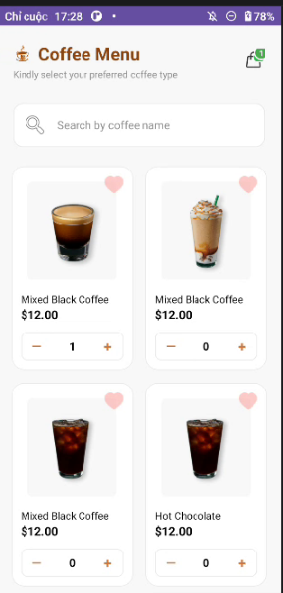

# Coffee Menu App

Ứng dụng quản lý thực đơn Coffee đơn giản với tính năng giỏ hàng, được xây dựng trên nền tảng Android (Java).

## 📸 Giao diện ứng dụng

Ứng dụng bao gồm 3 trạng thái màn hình chính:
1. **Màn hình Menu**: Hiển thị danh sách các loại Coffee, hỗ trợ tìm kiếm và thêm nhanh vào giỏ hàng.
2. **Màn hình Giỏ hàng (Có hàng)**: Hiển thị danh sách sản phẩm đã chọn, thay đổi số lượng và tính tổng tiền.
3. **Màn hình Giỏ hàng (Trống)**: Hiển thị thông báo khi không có sản phẩm nào trong giỏ.

## 🚀 Tính năng nổi bật
- **Tìm kiếm**: Lọc sản phẩm theo tên Coffee ngay tại màn hình chính.
- **Quản lý giỏ hàng**: 
    - Thêm/Bớt số lượng sản phẩm trực tiếp từ Menu hoặc trong Giỏ hàng.
    - Tự động xóa sản phẩm khỏi giỏ khi số lượng về 0.
- **Lưu trữ bền vững**: Sử dụng **GSON** để chuyển đổi đối tượng và **SharedPreferences** để lưu lại dữ liệu giỏ hàng ngay cả khi đóng ứng dụng.
- **UI/UX**: Thiết kế hiện đại, bo góc CardView, Badge thông báo số lượng trên icon giỏ hàng.

## 🛠 Công nghệ sử dụng
- **Ngôn ngữ**: Java
- **Thư viện Core**: 
    - `AppCompat`, `Material Design`, `ConstraintLayout`.
    - `RecyclerView`: Hiển thị danh sách tối ưu.
    - `GSON`: Xử lý dữ liệu JSON.
- **Lưu trữ**: `SharedPreferences`.
- **Kiến trúc**: Cấu trúc thư mục phân tách rõ ràng (Model, Adapter, Utils, Activity).

## 📁 Cấu trúc Project
- `model/`: Định nghĩa các đối tượng `Coffee` và `CartItem`.
- `adapter/`: Quản lý hiển thị danh sách (`CoffeeAdapter`, `CartAdapter`).
- `utils/`: Chứa `CartManager` - Lớp xử lý logic lưu trữ và tính toán giỏ hàng.
- `MainActivity.java`: Xử lý thực đơn và tìm kiếm.
- `CartActivity.java`: Xử lý giao diện và logic giỏ hàng.

## ⚙️ Cài đặt
1. Clone project về máy.
2. Mở bằng **Android Studio**.
3. Đảm bảo `compileSdk` được thiết lập là **36**.
4. Nhấn **Run** để khởi chạy trên Emulator hoặc thiết bị thật.

---
*Project được thực hiện bởi Đào Đức Tâm - ADR58*