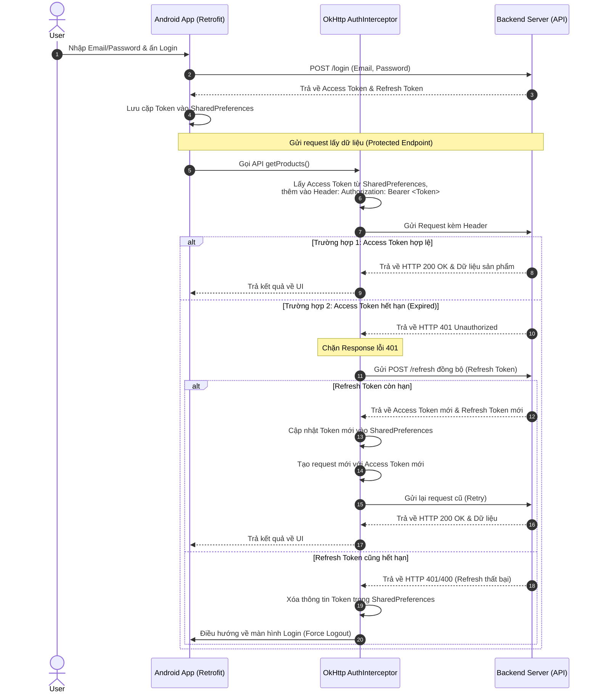

# COOKBOOK: Hướng dẫn triển khai Retrofit JWT Auth & Token Rotation trong Android (Java) từ đầu

Tài liệu này cung cấp hướng dẫn chi tiết từng bước để triển khai hệ thống xác thực JWT (JSON Web Token) sử dụng **Retrofit**, **OkHttp Interceptor**, và cơ chế tự động xoay vòng token (**Refresh Token**) trong ứng dụng Android sử dụng ngôn ngữ Java.

---

## Sơ đồ luồng hoạt động tổng quan (JWT Auth Flow)

Để hiểu rõ cách hoạt động của hệ thống, hãy xem sơ đồ dưới đây mô tả cách Access Token và Refresh Token phối hợp hoạt động khi tương tác với một Protected Endpoint (API bảo mật):



---

## PHASE 1: Khởi tạo Project & Gọi API Đăng Nhập Cơ Bản

Trong pha này, chúng ta sẽ thiết lập môi trường, các thư viện cần thiết, định nghĩa DTO và gọi API Đăng nhập cơ bản để nhận về Token.

### 1. Cấu hình Gradle & AndroidManifest

Đầu tiên, bạn cần khai báo quyền truy cập Internet và cài đặt các thư viện Retrofit, Gson, và OkHttp Logging trong file dự án.

#### AndroidManifest.xml
Thêm quyền Internet vào phía trên thẻ `<application>`:
```xml
<uses-permission android:name="android.permission.INTERNET" />
```

#### app/build.gradle
Cập nhật các thư viện mạng trong khối `dependencies`:
```groovy
dependencies {
    // Networking
    implementation 'com.squareup.retrofit2:retrofit:3.0.0'
    implementation 'com.squareup.retrofit2:converter-gson:3.0.0'
    implementation 'com.squareup.okhttp3:okhttp:5.3.0'
    implementation 'com.squareup.okhttp3:logging-interceptor:5.3.0'
}
```

### 2. Định nghĩa các Data Transfer Objects (DTO)

DTO là các class chứa cấu trúc dữ liệu gửi lên và nhận về từ API. Sử dụng `@SerializedName` của thư viện Gson để ánh xạ chính xác tên trường JSON với biến Java.

#### LoginRequest.java (Dữ liệu gửi đi khi đăng nhập)
```java
package com.adr57.netdemo.network.dto;

import com.google.gson.annotations.SerializedName;

public class LoginRequest {
    @SerializedName("email")
    private String email;

    @SerializedName("password")
    private String password;

    public LoginRequest(String email, String password) {
        this.email = email;
        this.password = password;
    }

    // Getters và Setters...
    public String getEmail() { return email; }
    public String getPassword() { return password; }
}
```

#### LoginResponse.java (Dữ liệu phản hồi đăng nhập)
```java
package com.adr57.netdemo.network.dto;

import com.google.gson.annotations.SerializedName;

public class LoginResponse {
    @SerializedName("success")
    private boolean success;

    @SerializedName("message")
    private String message;

    @SerializedName("user_id")
    private int userId;

    @SerializedName("email")
    private String email;

    @SerializedName("username")
    private String username;

    @SerializedName("access_token")
    private String token; // Đây chính là Access Token JWT

    @SerializedName("refresh_token")
    private String refreshToken;

    // Getters và Setters...
    public boolean isSuccess() { return success; }
    public String getToken() { return token; }
    public String getRefreshToken() { return refreshToken; }
    public int getUserId() { return userId; }
    public String getEmail() { return email; }
    public String getUsername() { return username; }
}
```

### 3. Thiết lập API Service Interface

Định nghĩa các endpoint thông qua các chú thích (Annotations) của Retrofit như `@POST`, `@GET`, `@Body`.

#### ApiService.java
```java
package com.adr57.netdemo.network;

import com.adr57.netdemo.network.dto.LoginRequest;
import com.adr57.netdemo.network.dto.LoginResponse;
import retrofit2.Call;
import retrofit2.http.Body;
import retrofit2.http.POST;

public interface ApiService {
    @POST("login")
    Call<LoginResponse> login(@Body LoginRequest loginRequest);
}
```

### 4. Xây dựng ApiClient Khởi Tạo Retrofit (Phiên bản Đơn Giản)

ApiClient chịu trách nhiệm thiết lập OkHttpClient và cấu hình cấu trúc chuyển đổi dữ liệu Gson.

#### ApiClient.java
```java
package com.adr57.netdemo.network;

import okhttp3.OkHttpClient;
import okhttp3.logging.HttpLoggingInterceptor;
import retrofit2.Retrofit;
import retrofit2.converter.gson.GsonConverterFactory;
import java.util.concurrent.TimeUnit;

public class ApiClient {
    private static final String BASE_URL = "http://192.168.1.3:3000/"; // Thay bằng IP của Server chạy API
    private static Retrofit retrofit = null;

    public static Retrofit getClient() {
        if (retrofit == null) {
            // Thêm logging để debug HTTP request/response trên Logcat
            HttpLoggingInterceptor logging = new HttpLoggingInterceptor();
            logging.setLevel(HttpLoggingInterceptor.Level.BODY);

            OkHttpClient okHttpClient = new OkHttpClient.Builder()
                    .addInterceptor(logging)
                    .connectTimeout(30, TimeUnit.SECONDS)
                    .readTimeout(30, TimeUnit.SECONDS)
                    .build();

            retrofit = new Retrofit.Builder()
                    .baseUrl(BASE_URL)
                    .addConverterFactory(GsonConverterFactory.create())
                    .client(okHttpClient)
                    .build();
        }
        return retrofit;
    }

    public static ApiService getApi() {
        return getClient().create(ApiService.class);
    }
}
```

### 5. Thiết lập Custom Callback (ApiCallback)

Để tách biệt logic gọi API khỏi Controller/Activity và tránh phải khai báo trực tiếp `retrofit2.Callback` ở tầng giao diện, chúng ta định nghĩa một callback custom ngắn gọn:

#### ApiCallback.java
```java
package com.adr57.netdemo.network;

public interface ApiCallback<T> {
    void onSuccess(T result);
    void onError(String error);
}
```

### 6. Xây dựng Repository để gọi API Đăng Nhập

Repository đóng vai trò trung gian lấy dữ liệu từ mạng (Retrofit) hoặc cơ sở dữ liệu.

#### ApiRepository.java
```java
package com.adr57.netdemo.network;

import com.adr57.netdemo.network.dto.LoginRequest;
import com.adr57.netdemo.network.dto.LoginResponse;
import retrofit2.Call;
import retrofit2.Callback;
import retrofit2.Response;

public class ApiRepository {
    private final ApiService apiService;

    public ApiRepository() {
        this.apiService = ApiClient.getApi();
    }

    public void login(LoginRequest loginRequest, ApiCallback<LoginResponse> callback) {
        Call<LoginResponse> call = apiService.login(loginRequest);
        // enqueue thực hiện gọi mạng bất đồng bộ trên background thread
        call.enqueue(new Callback<LoginResponse>() {
            @Override
            public void onResponse(Call<LoginResponse> call, Response<LoginResponse> response) {
                if (response.isSuccessful() && response.body() != null) {
                    callback.onSuccess(response.body());
                } else {
                    callback.onError("Đăng nhập thất bại: " + response.code());
                }
            }

            @Override
            public void onFailure(Call<LoginResponse> call, Throwable t) {
                callback.onError("Lỗi kết nối mạng: " + t.getMessage());
            }
        });
    }
}
```

### 7. Viết Code Đăng Nhập trong LoginActivity

Ở màn hình login, chúng ta thu thập thông tin email, password từ TextInputEditText và gửi thông tin qua repository.

#### LoginActivity.java
```java
package com.adr57.netdemo;

import android.os.Bundle;
import android.widget.Button;
import android.widget.Toast;
import androidx.appcompat.app.AppCompatActivity;
import com.adr57.netdemo.network.ApiCallback;
import com.adr57.netdemo.network.ApiRepository;
import com.adr57.netdemo.network.dto.LoginRequest;
import com.adr57.netdemo.network.dto.LoginResponse;
import com.google.android.material.textfield.TextInputEditText;

public class LoginActivity extends AppCompatActivity {
    private TextInputEditText edtEmail, edtPassword;
    private Button btnSignIn;
    private ApiRepository apiRepository;

    @Override
    protected void onCreate(Bundle savedInstanceState) {
        super.onCreate(savedInstanceState);
        setContentView(R.layout.activity_login);

        edtEmail = findViewById(R.id.edtEmail);
        edtPassword = findViewById(R.id.etPassword);
        btnSignIn = findViewById(R.id.btnSignIn);
        apiRepository = new ApiRepository();

        btnSignIn.setOnClickListener(v -> handleLogin());
    }

    private void handleLogin() {
        String email = edtEmail.getText().toString().trim();
        String password = edtPassword.getText().toString().trim();

        if (email.isEmpty() || password.isEmpty()) {
            Toast.makeText(this, "Vui lòng nhập đầy đủ thông tin", Toast.LENGTH_SHORT).show();
            return;
        }

        LoginRequest request = new LoginRequest(email, password);
        apiRepository.login(request, new ApiCallback<LoginResponse>() {
            @Override
            public void onSuccess(LoginResponse response) {
                Toast.makeText(LoginActivity.this, "Đăng nhập thành công!", Toast.LENGTH_SHORT).show();
                // Phase 2: Ở đây chúng ta sẽ lưu token nhận được từ response
            }

            @Override
            public void onError(String error) {
                Toast.makeText(LoginActivity.this, error, Toast.LENGTH_SHORT).show();
            }
        });
    }
}
```

---

## PHASE 2: Lưu Trữ Token & Quản Lý Phiên Đăng Nhập

Khi API trả về các Token thành công, chúng ta cần lưu trữ chúng một cách an toàn trên thiết bị (ở đây sử dụng `SharedPreferences`) để người dùng không phải đăng nhập lại mỗi khi mở app.

### 1. Tạo Lớp Quản Lý SharedPreferences (Singleton)

Sử dụng Singleton Pattern giúp truy cập vào một vùng nhớ lưu trữ duy nhất từ mọi lớp trong ứng dụng.

#### SharedPrefManager.java
```java
package com.adr57.netdemo.auth;

import android.content.Context;
import android.content.SharedPreferences;

public class SharedPrefManager {
    private static final String SHARED_PREF_NAME = "my_app_shared_pref";
    private static final String KEY_TOKEN = "key_token";
    private static final String KEY_REFRESH_TOKEN = "key_refresh_token";
    private static final String KEY_USER_ID = "key_user_id";
    private static final String KEY_USER_NAME = "key_user_name";
    private static final String KEY_USER_EMAIL = "key_user_email";
    private static final String KEY_IS_LOGGED_IN = "key_is_logged_in";

    private static SharedPrefManager instance;
    private final Context context;

    private SharedPrefManager(Context context) {
        this.context = context.getApplicationContext();
    }

    public static synchronized SharedPrefManager getInstance(Context context) {
        if (instance == null) {
            instance = new SharedPrefManager(context);
        }
        return instance;
    }

    // Lưu thông tin người dùng và token khi đăng nhập thành công
    public void saveUserData(String token, String refreshToken, int userId, String userName, String userEmail) {
        SharedPreferences sharedPreferences = context.getSharedPreferences(SHARED_PREF_NAME, Context.MODE_PRIVATE);
        SharedPreferences.Editor editor = sharedPreferences.edit();

        editor.putString(KEY_TOKEN, token);
        editor.putString(KEY_REFRESH_TOKEN, refreshToken);
        editor.putInt(KEY_USER_ID, userId);
        editor.putString(KEY_USER_NAME, userName);
        editor.putString(KEY_USER_EMAIL, userEmail);
        editor.putBoolean(KEY_IS_LOGGED_IN, true);
        editor.apply(); // Ghi dữ liệu bất đồng bộ xuống disk
    }

    // Cập nhật cặp token mới khi thực hiện xoay vòng token (Refresh Token)
    public void updateTokens(String newToken, String newRefreshToken) {
        SharedPreferences sharedPreferences = context.getSharedPreferences(SHARED_PREF_NAME, Context.MODE_PRIVATE);
        SharedPreferences.Editor editor = sharedPreferences.edit();
        editor.putString(KEY_TOKEN, newToken);
        editor.putString(KEY_REFRESH_TOKEN, newRefreshToken);
        editor.apply();
    }

    public boolean isLoggedIn() {
        SharedPreferences sharedPreferences = context.getSharedPreferences(SHARED_PREF_NAME, Context.MODE_PRIVATE);
        return sharedPreferences.getBoolean(KEY_IS_LOGGED_IN, false) && getToken() != null;
    }

    public String getToken() {
        SharedPreferences sharedPreferences = context.getSharedPreferences(SHARED_PREF_NAME, Context.MODE_PRIVATE);
        return sharedPreferences.getString(KEY_TOKEN, null);
    }

    public String getRefreshToken() {
        SharedPreferences sharedPreferences = context.getSharedPreferences(SHARED_PREF_NAME, Context.MODE_PRIVATE);
        return sharedPreferences.getString(KEY_REFRESH_TOKEN, null);
    }

    // Xóa sạch dữ liệu lưu trữ khi Logout hoặc Token hết hạn
    public void clear() {
        SharedPreferences sharedPreferences = context.getSharedPreferences(SHARED_PREF_NAME, Context.MODE_PRIVATE);
        SharedPreferences.Editor editor = sharedPreferences.edit();
        editor.clear();
        editor.apply();
    }
}
```

### 2. Tự động kiểm tra trạng thái Đăng Nhập khi mở App

Trong phương thức `onCreate()` của `LoginActivity`, ta kiểm tra xem user đã login chưa, nếu rồi thì chuyển thẳng qua màn hình chính mà không cần bắt đăng nhập lại:

```java
@Override
protected void onCreate(Bundle savedInstanceState) {
    super.onCreate(savedInstanceState);
    
    sharedPrefManager = SharedPrefManager.getInstance(this);
    if (sharedPrefManager.isLoggedIn()) {
        // Chuyển hướng tới Activity chính (Ví dụ ProductActivity)
        startActivity(new Intent(this, ProductActivity.class));
        finish(); // Hủy LoginActivity tránh bấm nút back quay lại được
        return;
    }
    setContentView(R.layout.activity_login);
    // ... setup views
}
```

Sau khi đăng nhập thành công qua Repository, hãy lưu dữ liệu vào preferences và thực hiện chuyển màn hình:

```java
apiRepository.login(request, new ApiCallback<LoginResponse>() {
    @Override
    public void onSuccess(LoginResponse response) {
        // Lưu thông tin
        sharedPrefManager.saveUserData(
            response.getToken(),
            response.getRefreshToken(),
            response.getUserId(),
            response.getUsername(),
            response.getEmail()
        );
        // Chuyển màn hình
        startActivity(new Intent(LoginActivity.this, ProductActivity.class));
        finish();
    }
    // ...
});
```

---

## PHASE 3: Interceptor Đính Kèm Authorization Header & Xoay Token Tự Động (Refresh Token)

Đây là pha cốt lõi của việc xử lý xác thực. Access Token có thời hạn ngắn (ví dụ 15 phút) để bảo mật. Khi hết hạn, app phải tự dùng Refresh Token (hạn dài, ví dụ 7 ngày) gửi lên API `/refresh` lấy Access Token mới một cách "ầm thầm" dưới nền để trải nghiệm người dùng không bị gián đoạn.

### 1. Interceptor trong OkHttp là gì?

> [!NOTE]
> **Interceptor** (Bộ chặn bắt) hoạt động giống như một chốt kiểm soát trên đường đi của Request/Response. Nó cho phép bạn:
> - Thay đổi request trước khi gửi đi (ví dụ: đính thêm token vào Authorization Header).
> - Đọc hoặc chỉnh sửa response nhận về từ máy chủ (ví dụ: phát hiện lỗi HTTP 401 Unauthorized để kích hoạt luồng làm mới Token).

### 2. Tạo TokenRepository Quản Lý Token Đồng Bộ

Chúng ta cần một Repository riêng biệt phục vụ việc lấy token từ SharedPreferences và đặc biệt là thực hiện gọi mạng **đồng bộ** (`call.execute()`) để xoay vòng token khi interceptor phát hiện lỗi Unauthorized.

#### TokenRepository.java
```java
package com.adr57.netdemo.network;

import android.content.Context;
import android.content.Intent;
import android.os.Handler;
import android.os.Looper;
import com.adr57.netdemo.LoginActivity;
import com.adr57.netdemo.auth.SharedPrefManager;
import com.adr57.netdemo.network.dto.RefreshRequest;
import com.adr57.netdemo.network.dto.TokenResponse;
import retrofit2.Call;
import retrofit2.Response;

public class TokenRepository {
    private final SharedPrefManager sharedPrefs;
    private final Context context;
    private ApiService apiService; // Gán từ ApiClient sau khi khởi tạo

    public TokenRepository(Context context) {
        this.context = context;
        this.sharedPrefs = SharedPrefManager.getInstance(context);
    }

    public void setApiService(ApiService apiService) {
        this.apiService = apiService;
    }

    public String getAccessToken() {
        return sharedPrefs.getToken();
    }

    public String getRefreshToken() {
        return sharedPrefs.getRefreshToken();
    }

    /**
     * Đồng bộ Refresh Token (Gọi bằng Call.execute() để chặn luồng hiện tại lại cho đến khi có kết quả)
     * Dùng từ khóa 'synchronized' để tránh việc nhiều request cùng lỗi 401 gọi refresh đồng thời gây lãng phí
     */
    public synchronized boolean refreshToken() {
        String refreshToken = getRefreshToken();
        if (refreshToken == null || refreshToken.isEmpty()) {
            forceLogout();
            return false;
        }

        try {
            RefreshRequest request = new RefreshRequest(refreshToken);
            // Quan trọng: Sử dụng apiService trực tiếp để gọi refresh token
            Call<TokenResponse> call = apiService.refreshToken(request);
            
            // execute() là gọi mạng ĐỒNG BỘ (Synchronous), nó sẽ block thread hiện tại 
            // (Thread này đang chạy ở background do OkHttp quản lý) cho tới khi nhận về kết quả
            Response<TokenResponse> response = call.execute();

            if (response.isSuccessful() && response.body() != null && response.body().isSuccess()) {
                TokenResponse body = response.body();
                // Lưu token mới vào SharedPreferences
                sharedPrefs.updateTokens(body.getAccessToken(), body.getRefreshToken());
                return true;
            } else {
                forceLogout();
            }
        } catch (Exception e) {
            e.printStackTrace();
            forceLogout();
        }
        return false;
    }

    /**
     * Trường hợp Refresh thất bại hoặc không có token -> Bắt buộc Logout người dùng
     */
    public void forceLogout() {
        sharedPrefs.clear();
        
        // Trở về Main Thread để mở LoginActivity và dọn dẹp Stack
        new Handler(Looper.getMainLooper()).post(() -> {
            Intent intent = new Intent(context, LoginActivity.class);
            // Xóa sạch các activity khác trong stack
            intent.setFlags(Intent.FLAG_ACTIVITY_NEW_TASK | Intent.FLAG_ACTIVITY_CLEAR_TASK);
            context.startActivity(intent);
        });
    }
}
```

> [!WARNING]
> Tại sao phải sử dụng `synchronized` và `execute()`? 
> Nếu ứng dụng của bạn kích hoạt 3 API bất đồng bộ cùng một lúc để lấy dữ liệu. Khi Access Token hết hạn, cả 3 API này sẽ đồng thời nhận lỗi `401 Unauthorized`. 
> - Nếu không dùng `synchronized`, app sẽ gửi 3 request làm mới token tới Server cùng lúc. Việc này làm quá tải và token trả về sau cùng sẽ vô hiệu hóa token trước đó.
> - Việc sử dụng `synchronized` giúp các request xếp hàng, luồng đầu tiên hoàn thành refresh token thành công sẽ giải phóng khóa và các luồng sau có thể sử dụng Access Token mới ngay lập tức mà không cần gọi lại API refresh.

### 3. Tạo AuthInterceptor Đính Kèm Token & Xử Lý Lỗi 401

#### AuthInterceptor.java
```java
package com.adr57.netdemo.network;

import okhttp3.Interceptor;
import okhttp3.Request;
import okhttp3.Response;
import java.io.IOException;

public class AuthInterceptor implements Interceptor {
    private final TokenRepository tokenRepo;

    public AuthInterceptor(TokenRepository tokenRepo) {
        this.tokenRepo = tokenRepo;
    }

    @Override
    public Response intercept(Chain chain) throws IOException {
        Request originalRequest = chain.request();

        // 1. Tự động đính kèm Access Token vào header nếu có
        String token = tokenRepo.getAccessToken();
        if (token != null) {
            originalRequest = originalRequest.newBuilder()
                    .header("Authorization", "Bearer " + token)
                    .build();
        }

        // 2. Thực hiện request và nhận response
        Response response = chain.proceed(originalRequest);

        // 3. Nếu nhận mã 401 hoặc 403 (Token hết hạn hoặc không hợp lệ)
        if (response.code() == 401 || response.code() == 403) {
            // Đóng response hiện tại để giải phóng tài nguyên trước khi tạo request mới
            response.close();

            // Tiến hành làm mới token đồng bộ
            if (tokenRepo.refreshToken()) {
                // Làm mới token thành công -> Lấy token mới vừa được lưu
                String newToken = tokenRepo.getAccessToken();
                
                // Tạo request mới thay thế Authorization Header bằng Access Token mới
                Request newRequest = originalRequest.newBuilder()
                        .header("Authorization", "Bearer " + newToken)
                        .build();
                        
                // Gửi lại request cũ (Retry)
                return chain.proceed(newRequest);
            } else {
                // Refresh thất bại (Ví dụ Refresh Token cũng hết hạn) -> Buộc đăng xuất
                tokenRepo.forceLogout();
            }
        }

        return response;
    }
}
```

### 4. Cấu hình Interceptor trong ApiClient

Liên kết `AuthInterceptor` và khởi tạo `TokenRepository` trong cấu hình máy khách Retrofit.

#### ApiClient.java (Cập Nhật)
```java
package com.adr57.netdemo.network;

import android.content.Context;
import okhttp3.OkHttpClient;
import okhttp3.logging.HttpLoggingInterceptor;
import retrofit2.Retrofit;
import retrofit2.converter.gson.GsonConverterFactory;
import java.util.concurrent.TimeUnit;

public class ApiClient {
    private static final String BASE_URL = "http://192.168.1.3:3000/";
    private static Retrofit retrofit = null;
    private static Context appContext;
    private static TokenRepository tokenRepository;

    public static void initialize(Context context) {
        appContext = context.getApplicationContext();
    }

    public static Retrofit getClient() {
        if (retrofit == null) {
            if (appContext == null) {
                throw new IllegalStateException("ApiClient chưa được initialize với Application Context!");
            }

            HttpLoggingInterceptor logging = new HttpLoggingInterceptor();
            logging.setLevel(HttpLoggingInterceptor.Level.BODY);

            OkHttpClient.Builder httpClient = new OkHttpClient.Builder();
            httpClient.addInterceptor(logging);
            httpClient.connectTimeout(30, TimeUnit.SECONDS);
            httpClient.readTimeout(30, TimeUnit.SECONDS);

            // Cấu hình AuthInterceptor và chuyển giao TokenRepository
            tokenRepository = new TokenRepository(appContext);
            httpClient.addInterceptor(new AuthInterceptor(tokenRepository));

            retrofit = new Retrofit.Builder()
                    .baseUrl(BASE_URL)
                    .addConverterFactory(GsonConverterFactory.create())
                    .client(httpClient.build())
                    .build();
        }
        return retrofit;
    }

    public static ApiService getApi() {
        ApiService service = getClient().create(ApiService.class);
        // Cung cấp tham chiếu ApiService cho TokenRepository để gọi API /refresh khi cần
        if (tokenRepository != null) {
            tokenRepository.setApiService(service);
        }
        return service;
    }
}
```

### 5. Khởi tạo ApiClient trong Application Class

Để đảm bảo `ApiClient` luôn được cung cấp Context từ sớm, ta khởi tạo nó tại lớp `Application` của dự án.

#### MyApplication.java
```java
package com.adr57.netdemo;

import android.app.Application;
import com.adr57.netdemo.network.ApiClient;

public class MyApplication extends Application {
    @Override
    public void onCreate() {
        super.onCreate();
        // Khởi tạo ApiClient với Application Context ngay từ khi ứng dụng bắt đầu
        ApiClient.initialize(this);
    }
}
```

Đừng quên khai báo lớp Application này trong thẻ `<application>` của **AndroidManifest.xml**:
```xml
<application
    android:name=".MyApplication"
    ... >
    <!-- ... -->
</application>
```

---

## PHASE 4: Tương Tác Với Protected Endpoint (Lấy Dữ Liệu Bảo Mật)

Giờ đây, khi gọi bất kỳ API bảo mật nào, `AuthInterceptor` sẽ tự động xử lý việc gắn Token cũng như làm mới Token nếu nó hết hạn. Các lập trình viên ở tầng giao diện không cần phải quan tâm tới JWT nữa!

### 1. Thêm Endpoint Lấy Sản Phẩm Trong ApiService

#### ApiService.java (Bổ Sung)
```java
// Định dạng Response chung cho dữ liệu sản phẩm
// Ví dụ: {"products": [...]} hoặc sử dụng Wrapper class như ListProductResponse
@GET("products")
Call<ListProductResponse<List<Product>>> getProducts();

// Endpoint Refresh Token
@POST("refresh")
Call<TokenResponse> refreshToken(@Body RefreshRequest refreshToken);
```

### 2. Thiết lập Dữ Liệu Model Product

#### Product.java
```java
package com.adr57.netdemo.model;

import com.google.gson.annotations.SerializedName;

public class Product {
    @SerializedName("id")
    private int id;

    @SerializedName("name")
    private String name;

    @SerializedName("description")
    private String description;

    @SerializedName("price")
    private double price;

    @SerializedName("product_image")
    private String productImage;

    // Getters và Setters...
}
```

### 3. Triển khai gọi dữ liệu trong Activity

Dữ liệu sẽ được gọi thông qua repository và hiển thị lên màn hình. Nhờ có `AuthInterceptor`, nếu token hết hạn trong lúc gọi dữ liệu, app sẽ tự lấy token mới rồi tải lại dữ liệu mà không báo lỗi ra màn hình.

#### ProductActivity.java
```java
package com.adr57.netdemo;

import android.os.Bundle;
import android.widget.Toast;
import androidx.appcompat.app.AppCompatActivity;
import androidx.recyclerview.widget.LinearLayoutManager;
import androidx.recyclerview.widget.RecyclerView;
import com.adr57.netdemo.adapter.ProductAdapter;
import com.adr57.netdemo.model.Product;
import com.adr57.netdemo.network.ApiCallback;
import com.adr57.netdemo.network.ApiRepository;
import java.util.ArrayList;
import java.util.List;

public class ProductActivity extends AppCompatActivity {
    private RecyclerView recyclerView;
    private ProductAdapter productAdapter;
    private List<Product> productList;
    private ApiRepository apiRepository;

    @Override
    protected void onCreate(Bundle savedInstanceState) {
        super.onCreate(savedInstanceState);
        setContentView(R.layout.activity_product);

        recyclerView = findViewById(R.id.recyclerView);
        recyclerView.setLayoutManager(new LinearLayoutManager(this));
        
        productList = new ArrayList<>();
        productAdapter = new ProductAdapter(productList);
        recyclerView.setAdapter(productAdapter);

        apiRepository = new ApiRepository();
        loadProducts();
    }

    private void loadProducts() {
        apiRepository.getProducts(new ApiCallback<List<Product>>() {
            @Override
            public void onSuccess(List<Product> data) {
                productList.clear();
                productList.addAll(data);
                productAdapter.notifyDataSetChanged();
            }

            @Override
            public void onError(String errorMessage) {
                // Nếu refresh thất bại hoàn toàn, TokenRepository đã tự động điều hướng sang LoginActivity,
                // Lỗi ở đây chủ yếu là do sự cố đường truyền mạng hoặc server sập.
                Toast.makeText(ProductActivity.this, "Không thể tải sản phẩm: " + errorMessage, Toast.LENGTH_SHORT).show();
            }
        });
    }
}
```

---

## Các Điểm Lưu Ý Quan Trọng Khi Thiết Kế Auth Với JWT

1. **Bảo mật Token**:
   - Sử dụng `EncryptedSharedPreferences` (thay thế cho `SharedPreferences` thông thường) nếu ứng dụng đòi hỏi mức độ bảo mật cao để mã hóa token lưu trữ dưới disk.
2. **Xử lý Thread trong Room & Retrofit**:
   - Retrofit thực hiện gọi mạng bất đồng bộ ở background thread nhưng phản hồi Callback (`onResponse` và `onFailure`) mặc định được chạy trên **Main Thread**. Do đó, việc cập nhật UI từ Callback là an toàn. Tuy nhiên, nếu bạn muốn lưu dữ liệu nhận được vào cơ sở dữ liệu (ví dụ Room DB), bạn phải chuyển tác vụ ghi đĩa đó sang một background thread/executor khác.
3. **Mã lỗi Refresh Token từ Server**:
   - Cần thống nhất với Backend về định dạng trả về khi Refresh Token bị sai hoặc hết hạn (thông thường là `HTTP 400 Bad Request` hoặc `HTTP 401 Unauthorized`).
